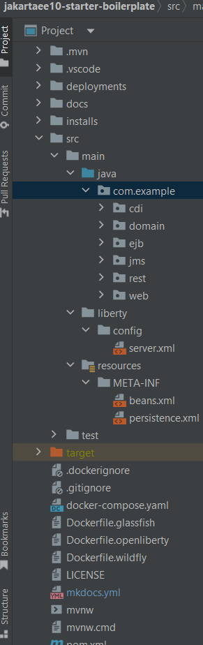

# Exploring Project Structure

The [Jakarta EE 10 Starter Boilerplate](https://github.com/hantsy/jakartaee10-starter-boilerplate) contains a colletion of example codes to demonstrate the basic of Jakarta EE specifications, such as JPA, JMS, CDI, EJB, Restful APIs, Faces, etc. 


## Clone Project Codes

Open a terminal, run the following command to get a copy of the starter codes.

```bash
git clone https://github.com/hantsy/jakartaee10-starter-boilerplate
```

## Project File Structure

Import the source codes into IDE, the following file structure is the project imported into the IDEA.



Under the *main/src/java* folder, expand the package `com.example.demo`, it contains several subpackages.

* `ejb` is an example of Stateless EJB to perform database CRUD operations. *NOTE: EJB is be deprecated in the further Jakarta EE*.
* `cdi` is to replace the `ejb` functionality, the codes are rewritten in regular CDI beans.
* `domain` contains a simple `ToDo` JPA Entity and some helper classes.
* `web` includes Faces backing beans example.
* `rest` includes Restful API example.
* `jms` contains a simple JMS example.

Under the *test* folder, it contains testing codes and configurations of running Arquillian tests.

