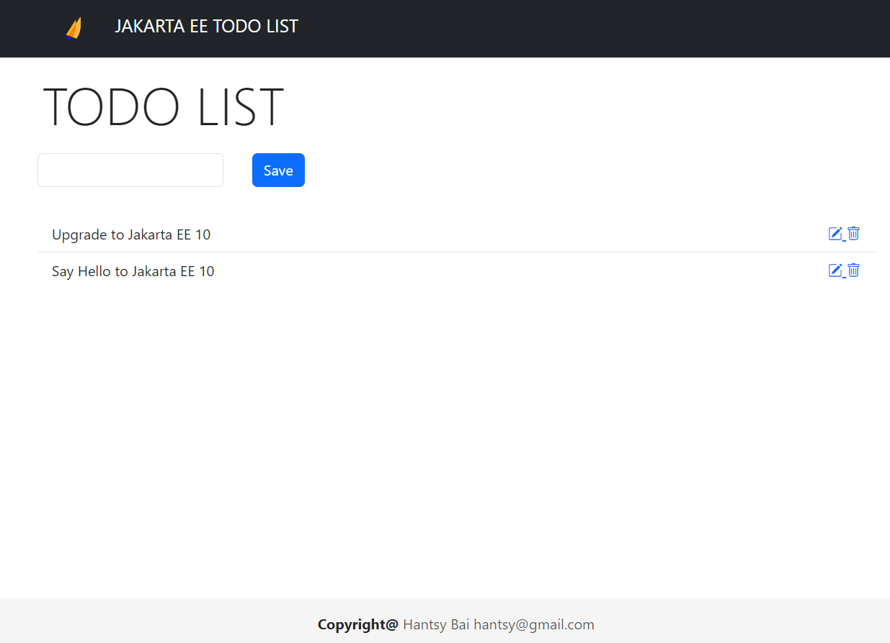

# Kickstart a Jakarta EE 10 Application

In the past years, I have maintained several starter boilerplate projects for Jakarta EE developers, including:

* [Jakarta EE 8 Starter Boilerplate](https://github.com/hantsy/jakartaee8-starter-boilerplate)
* [Jakarta EE 9 Starter Boilerplate](https://github.com/hantsy/jakartaee9-starter-boilerplate) 
* [Jakarta EE 9 Servlet Starter Boilerplate](https://github.com/hantsy/jakartaee9-servlet-starter-boilerplate)(for Servlet containers only, such as Jetty, Apache Tomcat). 

With these starter boilerplate projects, it is easy to start a new Jakarta EE project in seconds. 

Jakarta EE 10 was released for a few months, the most popular Jakarta EE providers, such as GlassFish v7, WildFly 27/28.x, OpenLiberty 23.0.0.4, etc. have been aligned with the newest Jakarta EE 10 specification. I think it is time to refresh the existing [Jakarta EE 9 Starter Boilerplate](https://github.com/hantsy/jakartaee9-starter-boilerplate), and provide an update for the new Jakarta EE 10.

This new [Jakarta EE 10 Starter Boilerplate](https://github.com/hantsy/jakartaee10-starter-boilerplate) is available on Github. Initially the project contains configuration for three of the most popular open-source application servers: 

* [Eclipse GlassFish](https://github.com/eclipse-ee4j/glassfish)
* [WildFly](https://www.wildfly.org/)
* [OpenLiberty](https://www.openliberty.org/)

Other Jakarta EE providers, such as Apache TomEE, etc. will be updated in future when it is updated to Jakarta EE 10.

Next let's go through this project.

## Getting Started

I assume you have installed the following software.

* [Git](https://git-scm.com/)
* JDK 17+
* The latest [Apache Maven](https://maven.apache.org)
* Your favorite text Editor or Java IDE

To start any development work, you have to prepare the development environment firstly. 

## Exploring Project Structure

Open a terminal, clone a copy of the source codes.

```bash
git clone https://github.com/hantsy/jakartaee10-starter-boilerplate
```

Import the source codes into IDE, such as IntelliJ IDEA, you will see the following file structure.


In contrast to [Jakarta EE 9 Starter Boilerplate](https://github.com/hantsy/jakartaee9-starter-boilerplate), the example codes are enriched. Beside simple CDI and Rest examples, I've added example codes to demonstrate JMS, EJB and JPA, etc.

1. It is a standard Maven project, in the project root folder, there is a *pom.xml* to manage Maven build lifecycle.
2. Under the *main/src/java* folder, expand the package `com.example.demo`, it contains several subpackages.

    * `ejb` is an example of Stateless EJB to perform database CRUD operations. *NOTE: EJB is be deprecated in the further Jakarta EE*.
    * `cdi` is to replace the `ejb` functionality, the codes are rewritten in regular CDI beans.
    * `domain` contains a simple `Todo` JPA Entity and some helper classes.
    * `web` includes Faces backing beans example.
    * `rest` includes Restful API example.
    * `jms` contains a simple JMS example.

3. Under the *test* folder, it contains testing codes and resources to run Arquillian tests.
4. Under the *.github/workflows*, there are several Github actions workflow for building to build the project and running tests against different Arquillian container adapters.
5. There are several Docker image definition file which prefix is *Dockerfile.*, which is used to build the application into a Docker image.
6. The *docker-compose.yaml* defines services to run GlassFish, WildFLy, OpenLiberty in docker container.

## Build and Run
In the docs of [Jakarta EE 9 starter boilerplate](https://github.com/hantsy/jakartaee9-starter-boilerplate), it introduced how to deploy to GlassFish, Payara, OpenLiberty servers, including managed and running servers. 

In this Jakarta EE 10 Starter Boilerplate, it only includes configuration for deploying application on local managed servers which is every common in the development stage.

### GlassFish

For example, run the following command to build the project and deploy application on a GlassFish server.

```bash 
mvn clean package cargo:run -Pglassfish
...
[INFO]
[INFO] --- cargo:1.10.7:run (default-cli) @ demo ---
[INFO] [en3.ContainerRunMojo] Resolved container artifact org.codehaus.cargo:cargo-core-container-glassfish:jar:1.10.7 for container glassfish7x
[INFO] [talledLocalContainer] Parsed GlassFish version = [7.0.4]
[INFO] [talledLocalContainer] GlassFish 7.0.4 starting...
[INFO] [talledLocalContainer] Attempting to start cargo-domain.... Please look at the server log for more details.....
[INFO] [talledLocalContainer] GlassFish 7.0.4 started on port [8080]
[INFO] Press Ctrl-C to stop the container...
```
Open another terminal window, use `curl` to verify the Todo Restful API example.

```bash
# curl http://localhost:8080/demo/api/todos
[{"id":"c34b0111-f4af-46b6-9749-acf4eba8077e","completed":false,"title":"Say Hello to Jakarta EE 10"}]
```

Open a web browser, and navigate to http://localhost:9080/demo to experience the Jakarta Faces Todo List example.




There is an endpoint used to verify JMS functionality, execute the following command.

```bash
# curl http://localhost:8080/demo/api/hellojms
sent
```

Open the *server.log* file, you will see the following information.

```bash
[2023-06-25T10:33:58.840509+08:00] [GF 7.0.5] [INFO] [] [com.example.jms.HelloJmsResource] [tid: _ThreadID=30 _ThreadName=http-listener-1(1)] [levelValue: 800] [[
  sayHello from HelloJmsResource]]

[2023-06-25T10:33:58.858512+08:00] [GF 7.0.5] [INFO] [] [com.example.jms.HelloSender] [tid: _ThreadID=30 _ThreadName=http-listener-1(1)] [levelValue: 800] [[
  sending message from HelloSender: Hello JMS at 2023-06-25T02:33:58.858512Z]]

[2023-06-25T10:33:58.865510+08:00] [GF 7.0.5] [WARNING] [] [jakarta.enterprise.resource.resourceadapter.com.sun.enterprise.connectors.service] [tid: _ThreadID=30 _ThreadName=http-listener-1(1)] [levelValue: 900] [[
  Probably the pool org.glassfish.resourcebase.resources.api.PoolInfo@29ad8a07[jndiName=jms/__defaultConnectionFactory-Connection-Pool, applicationName=null, moduleName=null] is not yet initialized (lazy-loading), trying to check ...]]

[2023-06-25T10:33:58.902509+08:00] [GF 7.0.5] [INFO] [] [jakarta.enterprise.resource.resourceadapter.com.sun.enterprise.resource.pool] [tid: _ThreadID=30 _ThreadName=http-listener-1(1)] [levelValue: 800] [[
  Created connection pool and added it to PoolManager: Pool [org.glassfish.resourcebase.resources.api.PoolInfo@29ad8a07[jndiName=jms/__defaultConnectionFactory-Connection-Pool, applicationName=null, moduleName=null]] PoolSize=0  FreeResources=0  QueueSize=0 matching=on validation=off]]

[2023-06-25T10:34:03.811980+08:00] [GF 7.0.5] [INFO] [] [com.example.jms.HelloConsumer] [tid: _ThreadID=122 _ThreadName=p: thread-pool-1; w: 4] [levelValue: 800] [[
  received message: Hello JMS at 2023-06-25T02:33:58.858512Z]]
```


More details of deploying Jakarta EE applications on GlassFish, check [Deploying to GlassFish v6.0 using Cargo maven plugin](https://github.com/hantsy/jakartaee9-starter-boilerplate/blob/master/docs/deploy-cargo.md) and [Remote Deployment to GlassFish v6.0 using Cargo local deployer](https://github.com/hantsy/jakartaee9-starter-boilerplate/blob/master/docs/deploy-cargo-gf6.md).
### WildFly

[WildFly](https://www.wildfly.org) project itself provides a great maven plugin to deploy Jakarta EE application to an embedded server, an existing server, or a running server.

Run the following command to deploy the application to a WildFly server.

```bash 
mvn clean wildfly:run -Pwildfly
```

More details of deploying to WildFly server, check [Deploying to WildFly](https://github.com/hantsy/jakartaee9-starter-boilerplate/blob/master/docs/deploy-wildfly.md) and [Deploying with WildFly Bootable Jar](https://github.com/hantsy/jakartaee9-starter-boilerplate/blob/master/docs/deploy-wildfly-bootable.md).
### OpenLiberty 

Simply run the following command to run the application on a local managed OpenLiberty server.


```bash 
mvn clean package liberty:dev -Popenliberty
```

The `liberty:dev` will redirect the background server log to the frontend console, it is easier to debug application.

> If you encountered an like [Detected JSESSIONID with invalid length; expected length of 23, found 49](https://github.com/OpenLiberty/open-liberty/issues/25554#issuecomment-1605517537), try to clear your browser cookie settings or add a HttpSession config fragment to the *server.xml* as [the comment](https://github.com/OpenLiberty/open-liberty/issues/25554#issuecomment-1605517537).

More details of deploying to OpenLiberty, check [Deploying to OpenLiberty](https://github.com/hantsy/jakartaee9-starter-boilerplate/blob/master/docs/deploy-openliberty.md).

## Testing 

I have written a couple of posts to describe how to test Jakarta components with Arquillian container adapters before. 

> If you are interested in the detailed configuration steps,  please go to the doc section of  [Jakarta EE 8 Starter Boilerplate](https://github.com/hantsy/jakartaee8-starter-boilerplate) and [Jakarta EE 9 Starter Boilerplate](https://github.com/hantsy/jakartaee9-starter-boilerplate). 

In this new Jakarta EE 10 Starter Boilerplate project, I have ported the following Arquillian container adapters configuration with the latest application servers.

* GlassFish Managed Container
* GlassFish Remote Container
* WildFly Managed Container
* WildFly Remote Container
* OpenLiberty Managed Container
* OpenLiberty Remote Container

### GlassFish Managed Container

In this case,the test will manage the GlassFish container lifecycle, start, deploy, run test, undeploy, stop.

Run the following command to run tests against a GlassFish managed container adapter.

```bash 
mvn clean verify -Parq-glassfish-managed
```

### GlassFish Remote Container

Make sure there is a running GlassFish server.

Run the following command to run tests against a GlassFish remote container adapter.

```bash 
mvn clean verify -Parq-glassfish-managed
```

### WildFly Managed Container

Similarly run the following command to run tests against a WildFly managed container adapter.

```bash 
mvn clean verify -Parq-wildfly-managed
```

### GlassFish Remote Container

Make sure there is a running WildFly server.

Execute the following command to add an administrator user.

```bash
<WILDFLY_INSTALLDIR>/bin/add-user.sh admin Admin@123 --silent
```

Then run the following command to run tests against a WildFly remote container adapter.

```bash 
mvn clean verify -Parq-wildfly-managed
```

### OpenLiberty Managed Container

There is a specific *test/arq-liberty-managed/server.xml* file prepared for the OpenLiberty managed container adapter. In the feature list, it adds extra `local-connector` and `usr:arquillian-support-jakarta-2.0` features for support connection to a local server.

Similarly run the following command to run tests against a OpenLiberty managed container adapter.

```bash 
mvn clean verify -Parq-liberty-managed
```

### OpenLiberty Remote Container

Similarly there is a *test/arq-liberty-remote/server.xml* file prepared for the OpenLiberty remote container adapter. In the feature list, add a `rest-connector` to support connection via REST protocol to a running server.

In the server.xml file, we also enabled SSL support, but the OpenLiberty generated security certificates are not recognized by client(the JVM to run tests), we need to extract cert file from OpenLiberty, and import into the client Java security folder. The detailed steps, please refer the doc [Testing with Arquillian and OpenLiberty](https://github.com/hantsy/jakartaee9-starter-boilerplate/blob/master/docs/arq-openliberty.md).

Make sure the OpenLiberty is running.

Run the following command to run tests against an OpenLiberty remote container adapter.

```bash
mvn clean verify -Parq-liberty-remote
```

> There is an issue in the new Jakarta port of OpenLiberty Arquillian project, which causes the injection of `EntityManager` failed, more details please go to [liberty-arquillian#134](https://github.com/OpenLiberty/liberty-arquillian/issues/134).